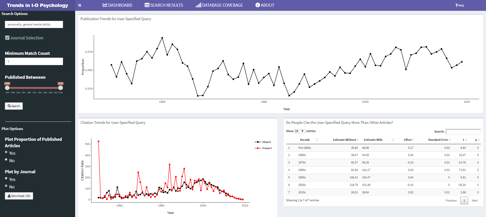
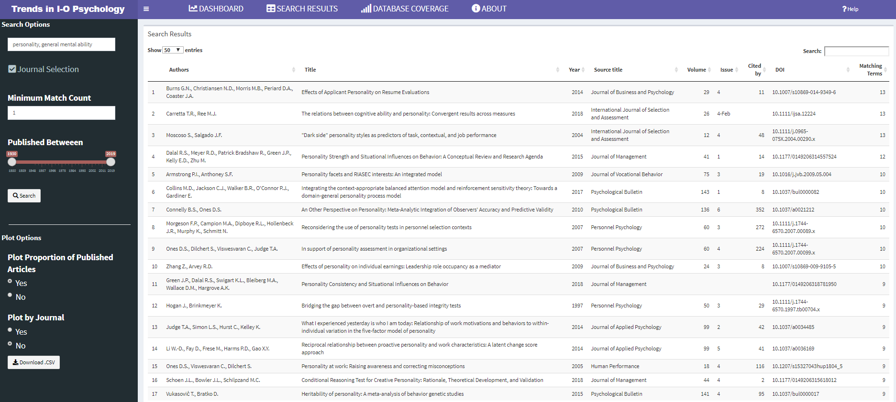
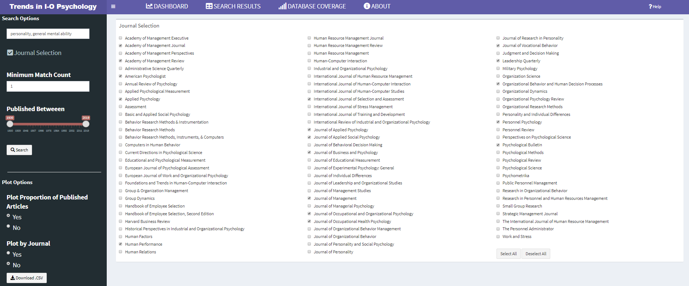

Trends in I-O Psychology
================

## Trends in Industrial-Organizational Psychology

As scientists search for new insights into the world of work, topics
inevitably fall in and out of vogue. Perhaps the most volatile and well
recognized swings in research interests have been observed in
personality research. Walter Mischel’s 1968 book *Personality and
Assessment* came to the gloomy conclusion that “\[w\]ith the possible
exception of intelligence, highly generalized behavioral consistencies
have not been demonstrated, and the concept of personality traits as
broad response predispositions is thus untenable.” After this book was
published, personality research for selection and assessment slowed
considerably until about a decade later. Identifying these trends (and
slumps) can help researchers and practitioners see where the field is
headed, where it has been, and identify ideas and topics that should be
brought to light once again.

This app was designed to help researchers and practitioners identify
current trends in industrial-organizational psychology. It uses
user-defined queries to search article abstracts in I-O psychology’s top
scientific journals. Search results are plotted over time, and users
have the option to focus on specific (or all) journals, and download a
.csv file of their generated data. Additionally, search results are used
to predict citation rates across the decades. Feel free to download and
adapt the app to your needs, or submit a request and we will see if we
can help.

## System Requirements

In addition to R and R Studio, this app depends on the following
packages:

    1. shiny
    2. shinyBS
    3. shinydashboard
    4. tidyverse
    5. tidytext
    6. plotly
    7. knitr
    8. vroom

Dependencies can easily be installed and loaded by running the following
code.

``` r
source("https://raw.githubusercontent.com/zktraylor/trends_in_io/master/install_dependencies.R")
```

## How to Run

Download the repository and run the following
code in your RStudio console.

``` r
# First clone the repository with git. If you have cloned it into
# ~/shiny_example, first go to that directory, then use runApp().
setwd("~/shiny_example")
runApp()
```

## Screenshots







## Old Change Logs

### January 2020

  - Significant speed improvements
  - Internal reorganization
  - Action button for new search

### October 2019

  - Added ability to quickly select and deselect all journals
  - Completely overhauled UI
  - Refined outputted visualizations

### September 2019

  - Expanded database coverage to include 30 additional journals
  - Included citation-rate visualization
  - Implemented data import via `vroom` to increase speed
  - UI update
  - Aesthetic improvements
  - Code improvements and clarity
